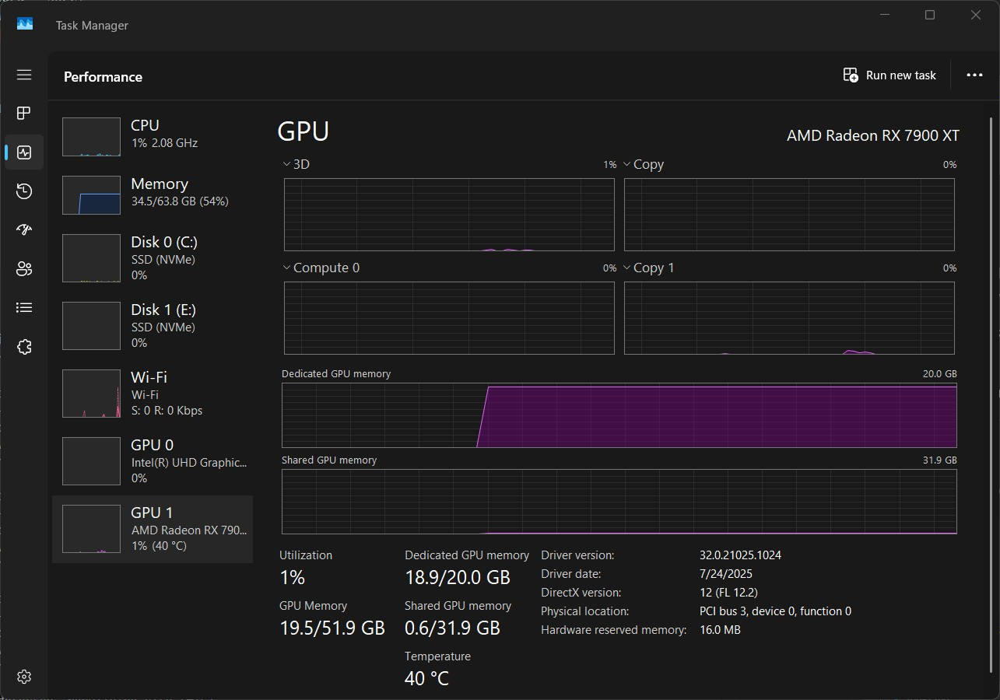
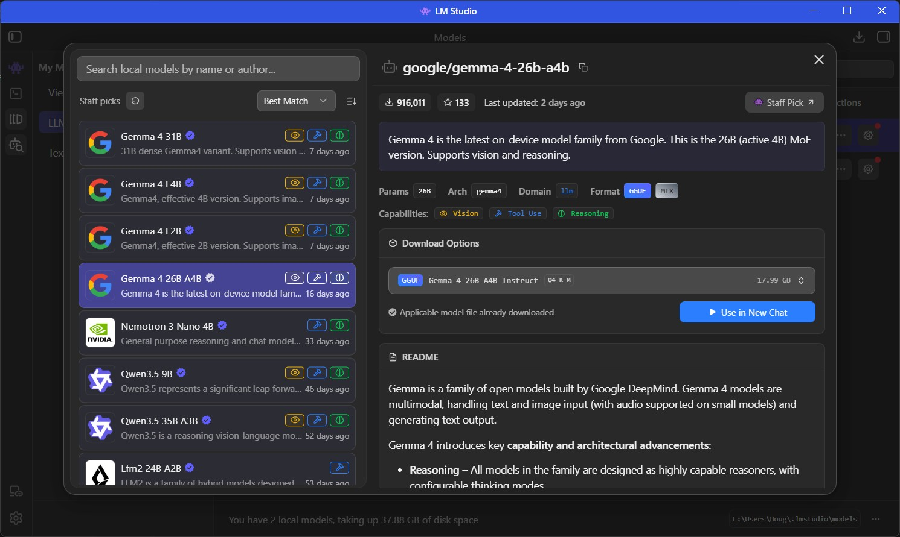
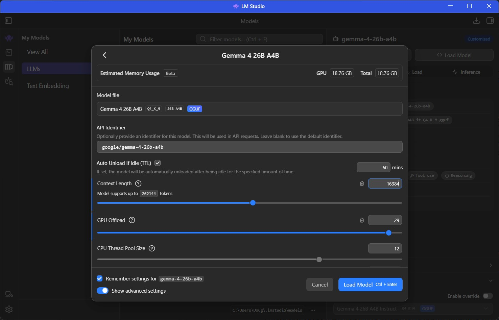

+++
title = "Local LLm Assisted VsCode Setup"
date = "2026-04-18"
author = "Doug Flick"
cover = "Copilot-Setup.jpg"
description = "Getting started with Local AI agents for Development"
keywords = ['AI', 'Coding', 'VsCode', 'Basic AI']
+++

A Note on Updates
This guide is a work in progress. As I refine my workflow, I will update these instructions using the following marker to denote changes:
>  ✏️ [EDIT MM/DD/YYYY]

## Preamble

Large Language Models are rapidly changing how we architect, write, and review code. However, relying solely on hosted APIs from Anthropic or OpenAI can get expensive, especially when you're just experimenting or learning a new technology.

I also wanted to get a better grasp of how this technology works under the hood without sending every prompt to a third-party server. To that end, I’m starting a series of posts to document my journey of setting up local tools and discussing what works, what breaks, and what's worth the effort.

If you're looking for deep technical dives into the architecture, I highly recommend [this post on MicroGPT](https://growingswe.com/blog/microgpt) as a foundational resource.

Finding a starting point in the local LLM space is overwhelming. I spent a some time lurking in [r/LocalLLaMA](https://www.reddit.com/r/LocalLLaMA/), but can feel like drinking from a firehose.

----
## Background on Models vs Inference Engines

Choosing Your Inference Engine
Before diving into the setup, it is important to distinguish between Models and Inference Engines. Think of the Model as a movie file (like an .mp4) and the Inference Engine as the media player (like VLC). The model contains the intelligence, but you need the engine to actually run it on your hardware.

In my research, I've found a spectrum of tools available:

- [Ollama](https://ollama.com/): The easiest "plug-and-play" option, but offers the least amount of granular control.
- [llama.cpp](https://github.com/ggml-org/llama.cpp): Faster and highly configurable, but requires more technical knowledge to optimize.
- [vLLM](https://github.com/vllm-project/vllm): Highly performant and widely regarded as the industry standard, though it is primarily optimized for Linux environments.

For this guide, I am targeting the "Goldilocks zone" — a balance of ease of use and moderate configurability. Therefore, we will be using [LM Studio](https://lmstudio.ai/), which provides a user-friendly interface without sacrificing essential settings.

An advantage of LM Studio is its seamless integration with [Hugging Face](https://huggingface.co/). While many inference engines require you to manually hunt for, download, and move model files (such as .gguf or MLX formats) into specific folders, `LM Studio` handles this internally. You can search for models directly within the application and download them with a single click.

This integrated search is particularly useful when determining which models are compatible with your specific hardware. Choosing an LLM isn't just about finding the most "intelligent" model; it’s about matching the model's size to your available `VRAM` (Video RAM).

If you have a dedicated graphics card, the goal is to fit as much of the model as possible into its memory. When a model exceeds your GPU's `VRAM` capacity, the system is forced to "spill over" into your much slower `system RAM`, which can result in a massive drop in generation speed. LM Studio helps bridge this gap by providing visibility into these requirements, allowing you to see which versions of a model (quantizations) are likely to run smoothly on your specific setup without overwhelming your hardware.

However, there is one more critical variable to manage: the `Context Window`. It is important to remember that the "memory" of the conversation (i.e. the amount of text the model can process and remember at once) also occupies `VRAM`. Even if a model's base file fits comfortably on your GPU, setting an excessively large `context size` can push you over your memory limit, triggering the same performance drop-off described earlier. I'm still learning how to optimize this. So I might not be able to give the best suggestion right now - however I will walk through the approach I used and might revist this with better suggestions later.

We can keep track of our systems usage through a resource manager - which on windows can be task manager - and make optimizations as we need.

## Setting up your Inference Engine

Using LM Studio the first thing we need to do is download a model. Now my desktop has a graphics card - specifically a `AMD Radeon RX 7900 XT` and that affords me about 20 Gb of VRAM . LM Studio will try recommend models that will fit in this space - for me that was [google/gemma-4-26b-a4b
](https://lmstudio.ai/models/google/gemma-4-26b-a4b) which I've now downloaded. Importantly make sure the model you are downloading supports `Tool Support` as that's what is required for the model to use tooling.

Once my download is complete, it's time to load the model into memory. You can certainly just use the default settings, but if you're like me and want to squeeze every bit of performance out of your hardware, I highly recommend using the `My Models` view to fine-tune your optimizations. This interface gives you the settings that control model interactions. I've also been relying on the `Estimated Memory Usage`(currently in Beta) to ensure I don't accidentally overflow my VRAM and hit the performance drop-off.

Here is how I typically set it up:

- Navigate to `My Models` on the left-hand side.
- Click the `<> Load Model` button on the right.

This will bring up the following screen:

The two main settings I've modified were:
- Context Length - set to `16Kb`
- GPU Offload - set to `29/30`

With the goal being staying far enough off the top of VRAM that my `KV CACHE` doesn't overflow, I've left roughly 1.4 Gb free which seems stable for now. However, as conversations grow longer, we'll see how it holds up. Additionally, I made a few more modifications to my system to increase stability, which I'll discuss in a different post.

## Setting up VS Code Chat

First lets start by installing [github copilot llm gateway](https://marketplace.visualstudio.com/items?itemName=AndrewButson.github-copilot-llm-gateway)

-----
> 🏗️ Under Construction
-----