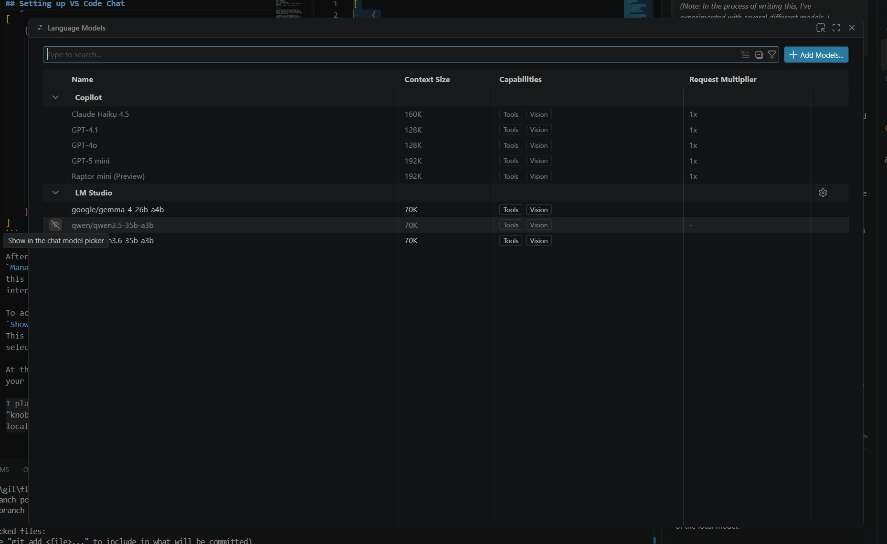

+++
title = "Local LLm Assisted VsCode Setup"
date = "2026-04-18"
author = "Doug Flick"
cover = "Copilot-Setup.jpg"
description = "Getting started with Local AI agents for Development"
tags = ['AI', 'Coding', 'VsCode', 'Basic AI']
+++

## Preamble

Large Language Models are rapidly changing how we architect, write, and review code. However, relying solely on hosted APIs from Anthropic or OpenAI can get expensive, especially when you're just experimenting or learning a new technology.

I also wanted to get a better grasp of how this technology works under the hood without sending every prompt to a third-party server. To that end, I’m starting a series of posts to document my journey of setting up local tools and discussing what works, what breaks, and what's worth the effort.

If you're looking for deep technical dives into the architecture, I highly recommend [this post on MicroGPT](https://growingswe.com/blog/microgpt) as a foundational resource.

Finding a starting point in the local LLM space is overwhelming. I spent a some time lurking in [r/LocalLLaMA](https://www.reddit.com/r/LocalLLaMA/), but can feel like drinking from a firehose.

*(Note: In the process of writing this, I've experimented with several different models. I recommend finding the one that works best for your needs—for example, I've found Gemma particularly useful for creative writing tasks such as this.)*


----
## Background on Models vs Inference Engines

Choosing Your Inference Engine
Before diving into the setup, it is important to distinguish between Models and Inference Engines. Think of the Model as a movie file (like an .mp4) and the Inference Engine as the media player (like VLC). The model contains the intelligence, but you need the engine to actually run it on your hardware.

In my research, I've found a spectrum of tools available:

- [Ollama](https://ollama.com/): The easiest "plug-and-play" option, but offers the least amount of granular control.
- [llama.cpp](https://github.com/ggml-org/llama.cpp): Faster and highly configurable, but requires more technical knowledge to optimize.
- [vLLM](https://github.com/vllm-project/vllm): Highly performant and widely regarded as the industry standard, though it is primarily optimized for Linux environments.

For this guide, I am targeting the "Goldilocks zone" — a balance of ease of use and moderate configurability. Therefore, we will be using [LM Studio](https://lmstudio.ai/), which provides a user-friendly interface without sacrificing essential settings.

An advantage of LM Studio is its seamless integration with [Hugging Face](https://huggingface.co/). While many inference engines require you to manually hunt for, download, and move model files (such as .gguf or MLX formats) into specific folders, `LM Studio` handles this internally. You can search for models directly within the application and download them with a single click.

This integrated search is particularly useful when determining which models are compatible with your specific hardware. Choosing an LLM isn't just about finding the most "intelligent" model; it’s about matching the model's size to your available `VRAM` (Video RAM).

If you have a dedicated graphics card, the goal is to fit as much of the model as possible into its memory. When a model exceeds your GPU's `VRAM` capacity, the system is forced to "spill over" into your much slower `system RAM`, which can result in a drop in generation speed. LM Studio helps bridge this gap by providing visibility into these requirements, allowing you to see which versions of a model (quantizations) are likely to run smoothly on your specific setup without overwhelming your hardware.

However, there is one more critical variable to manage: the `Context Window`. It is important to remember that the "memory" of the conversation (i.e. the amount of text the model can process and remember at once) also occupies `VRAM`. Even if a model's base file fits comfortably on your GPU, setting an excessively large `context size` can push you over your memory limit, triggering the same performance drop-off described earlier. I'm still learning how to optimize this. So I might not be able to give the best suggestion right now - however I will walk through the approach I used and might revist this with better suggestions later.

We can keep track of our systems usage through a resource manager - which on windows can be task manager - and make optimizations as we need.


## Setting up your Inference Engine

Using LM Studio, the first thing we need to do is download a model. My desktop has a `AMD Radeon RX 7900 XT`, which provides about 20 GB of VRAM. Originally, my goal was to find a model that could fit entirely within this VRAM capacity to ensure maximum speed. However, after reading several posts about how impressive Qwen models are for programming tasks, I decided to give [Qwen/Qwen3.6-35B-A3B
](https://lmstudio.ai/models/Qwen/Qwen3.6-35B-A3B) a try, even though it pushes past my GPU's limits and spills over into my System RAM. 

Importantly make sure the model you are downloading supports `Tool Support` as that's what is required for the model to use tooling.


Once the download is complete, it’s time to load the model. While the default settings will get you up and running, I highly recommend using the `My Models` view to fine-tune your hardware optimizations. Since I have a `Intel i9` processor, I am happy to let some of the workload spill over to my CPU to gain access to more intelligent models.

Here is how I typically set it up:

- Navigate to `My Models` on the left-hand side.
- Click the `< > Load Model` button on the right.

This will bring up the following screen:


The key settings I've modified for this setup are:
- **Context Length**: Increased to `64Kb` (65,536 tokens) to handle larger code snippets.
- **GPU Offload**: Set to `32/40` layers. 
- **MoE CPU Layers**: Set to `4` (forcing specific MoE weights onto the CPU to leverage my i9).

This configuration results in a total memory usage of about `22.90 GB` (`18.89 GB` on the GPU and the rest in System RAM). While the generation speed isn't super fast due to the overhead, the trade-off for much higher reasoning capabilities is well worth it - it's definitely acceptable for a coding workflow!

> Note: These settings aren't "one size fits all." Depending on the specific model, you may find that partial offloading is more efficient. Tuning these values is a balancing act between generation speed and stability.

## Setting up VS Code Chat

Since VS Code does not natively support local inference engines like LM Studio, llama.cpp, or vLLM, we need a way to bridge the gap. We essentially have two paths:

- [Github Copilot LLM Gateway](https://marketplace.visualstudio.com/items?itemName=AndrewButson.github-copilot-llm-gateway)
- [VS Code Insider](https://code.visualstudio.com/insiders)

I decided to go with **VS Code Insiders** so I can stay on the cutting edge of new features. 

To get this working with LM Studio, you first need to "register" the connection in VS Code. In your **Chat** window, go to the model selection menu and select `> Other Models`. From there, click `Manage Models...` at the bottom, then hit `+ Add Models...` in the top right. 

Choose **OpenAI Compatible**, give it a name, and hit enter. If you have an API key, add it now; otherwise, just move to the next step.

Once that's done, you'll need to do one final bit of configuration. You have to update your `chatLanguageModels.json` file to tell VS Code exactly which model you're running and where it lives. Here is the specific configuration I used for my setup:

```json
[
	{
		"name": "LM Studio",
		"vendor": "customoai",
		"models": [
			{
				"id": "qwen/qwen3.5-35b-a3b",
				"name": "qwen/qwen3.5-35b-a3b",
				"url": "http://127.0.0.1:8080",
				"toolCalling": true,
				"vision": true,
				"thinking": true,
				"temperature": 0.2,
				"maxInputTokens": 65536,
				"maxOutputTokens": 4096
			}
		]
	}
]
```

After you've saved your JSON file, go back to the `Manage Models...` view. If your model is grayed out - this just means it hasn't been activated in the chat interface yet.

To activate it, look to the right-hand side and click `Show in model chat picker` with a crossed out eye icon. This "unhides" the model, making it available for selection in the model selection menu.



At this point! You should have a working local llm in your chat - ready to assist you in programming!

I plan to in a follow up post write about what all these "knobs" do and how to get behavior you desire out of the local model.